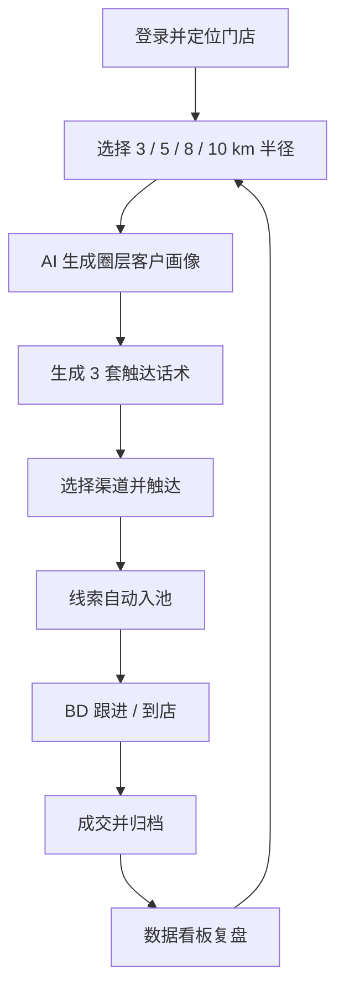

# 邻客 AI - 本地获客智能体 PRD

## 1. 产品概述

**邻客 AI** 是一款面向本地商户（餐饮、零售、教培、医美、健身、家政等）的"按公里圈选 + AI 智能获客"工作台。商户可一键以自身位置为圆心，圈选 3 / 5 / 8 / 10 公里半径内的潜在客群，AI 自动完成人群画像洞察、获客话术生成、触达策略编排与转化漏斗追踪，将"门店周边流量"沉淀为可经营、可复用的私域客户资产。

- **核心问题**：本地商户拓客依赖发传单、扫街加微等高成本、低转化的方式，缺乏数据化、AI 化的获客工作台。
- **目标用户**：单店店长、连锁品牌区域负责人、本地服务创业者、地推 BD。
- **市场价值**：替代传统地推 + 短信群发的"低质流量"模式，把"周边 3-10 公里"的精准流量变成可量化、可复盘的获客漏斗。

## 2. 核心功能

### 2.1 用户角色

| 角色 | 注册方式 | 核心权限 |
|------|----------|----------|
| 商家主账号 | 手机号 + 营业执照 OCR（可选） | 创建门店、设置半径、查看全量数据、导出线索 |
| 门店店长 | 主账号邀请加入 | 运营所属门店的获客活动、跟进线索 |
| 地推 BD | 主账号邀请加入 | 仅可领取/跟进被分配的线索、记录到店 |

### 2.2 功能模块

1. **首页 / 获客驾驶舱**：当前定位、半径切换（3 / 5 / 8 / 10 km）、实时商圈热力、AI 今日建议。
2. **地图获客工作台**：以同心圆 3 / 5 / 8 / 10 km 渲染圈选范围，分层呈现写字楼 / 住宅 / 学校 / 商超等高潜客群，AI 标注"高潜指数"。
3. **AI 客户画像**：选定圈层后自动生成人群画像（年龄、性别、消费力、到店动因、痛点关键词），并产出 3 套触达话术。
4. **智能营销中心**：话术 → 渠道（短信 / 朋友圈 / 企微 / 抖音同城 / 外卖平台卡券）一键编排，支持定时定向推送。
5. **线索池与跟进**：自动收集意向客户，分配给 BD，记录"加微 - 到店 - 成交"全链路。
6. **数据看板**：圈层覆盖人数、曝光、加微成本、到店率、ROI，支持按日 / 周 / 月查看。
7. **门店与权限管理**：多门店切换、员工角色管理、消费额度与配额。

### 2.3 页面详情

| 页面名称 | 模块名称 | 功能描述 |
|----------|----------|----------|
| 登录 / 注册 | 账号体系 | 手机号 + 验证码，企业账号可补充营业执照 |
| 获客驾驶舱 | 定位 + 半径 | 顶部展示当前门店位置；提供 3 / 5 / 8 / 10 km 四个胶囊按钮，可单独 / 多选切换 |
| 获客驾驶舱 | 今日 AI 建议 | 基于历史数据 + 天气 + 节假日，AI 推荐 1-2 条今日获客动作 |
| 地图工作台 | 同心圆地图 | 地图渲染 4 层同心圆，叠加热力图层；支持 POI 标签筛选 |
| 地图工作台 | 高潜客群卡片 | 选中圈层后右侧滑出卡片列表，含 AI 评分与一键"生成话术" |
| AI 客户画像 | 画像报告 | 自然语言描述人群特征 + 雷达图 + 关键词云 |
| AI 客户画像 | 话术生成 | 一键生成 3 套话术（短文案 / 长图文 / 私信），可微调并保存为模板 |
| 智能营销中心 | 渠道编排 | 拖拽式画布：触发条件 → 渠道动作 → 等待时长 → 二次触达 |
| 线索池 | 列表 + 详情 | 按状态分组（待跟进 / 已加微 / 已到店 / 已成交 / 已流失） |
| 线索详情 | 跟进时间线 | 展示客户来源、触达记录、对话要点（AI 总结） |
| 数据看板 | ROI 总览 | 核心指标卡片 + 趋势折线 + 圈层对比柱状图 |
| 门店管理 | 成员与权限 | 邀请员工、分配门店、设置配额 |

## 3. 核心流程

**主流程**：商户登录 → 自动定位门店 → 选择 3 / 5 / 8 / 10 km 圈层 → AI 生成客户画像 → 生成话术 → 编排触达 → 收集线索 → 跟进转化 → 复盘数据。

## 4. 用户界面设计

### 4.1 设计风格

- **主色调**：墨黑 `#0B0B0F`（底色）+ 暖橙 `#FF6A2C`（强调，用于"半径按钮 / CTA / 评分"）+ 冷青 `#3CE0C6`（AI 与数据高亮）。
- **辅助色**：中性灰阶（`#1C1C24` / `#2A2A33` / `#7A7A85`）。
- **按钮风格**：胶囊大圆角（半径 999px），主操作使用实心暖橙，次操作使用描边冷青；切换状态使用"被选中外环 + 内部同心圆脉冲动画"。
- **字体**：标题 `HarmonyOS Sans Bold` / `Manrope`；数字与距离使用等宽 `JetBrains Mono`；正文 `PingFang SC` / `Inter`。
- **布局风格**：左导航 + 主内容双栏；地图工作台采用全屏沉浸式，右侧抽屉承载画像与话术。
- **图标 / 表情**：线性极简图标（Lobe 风格），点缀霓虹光晕；不使用 emoji 装饰。

### 4.2 页面设计概述

| 页面名称 | 模块名称 | UI 元素 |
|----------|----------|---------|
| 获客驾驶舱 | 顶部 | 顶栏含门店切换、半径选择胶囊、搜索、AI 助手入口 |
| 获客驾驶舱 | 半径选择 | 3 / 5 / 8 / 10 km 四个胶囊；选中后展示对应距离数字与覆盖人数 |
| 获客驾驶舱 | 今日建议 | 卡片：AI avatar + 建议文字 + "立即执行"按钮 |
| 地图工作台 | 同心圆 | 地图底层暖灰；4 圈以墨黑描边 + 不同透明度橙色填充 |
| 地图工作台 | 高潜 POI | 楼宇、学校、商场等以几何图标呈现，悬停显示"高潜指数" |
| 地图工作台 | 右侧抽屉 | 半透明深色毛玻璃 + 渐变高光 |
| AI 画像 | 报告 | 顶部大字号总结句 + 雷达图 + 标签云 |
| AI 画像 | 话术 | 三张并排卡片，每张底部"复制 / 投递"按钮 |
| 智能营销中心 | 编排画布 | 节点式画布，节点使用不同冷色 / 暖色编码 |
| 线索池 | 列表 | 状态用彩色描边卡片；底部固定"批量触达"浮动按钮 |
| 数据看板 | 总览 | 顶部 4 个大数字卡 + 下方双图表 |

### 4.3 响应式

- **Desktop 优先**（≥ 1280px）：完整三栏布局（导航 / 地图 / 抽屉）。
- **Tablet**（768 - 1280px）：导航折叠为侧边图标，地图与抽屉上下分屏。
- **Mobile**（< 768px）：地图占顶部 50%，下方为内容 Tab；半径切换改为底部固定胶囊条。

### 4.4 3D 场景指引

不涉及 3D 场景。但地图工作台会使用 WebGL 加速的热力层与同心圆脉冲动画：
- **环境氛围**：暗色地图 + 暖橙光晕 + 冷青 AI 描边，呈现"科技夜视"风格。
- **动效**：选中半径时，对应圆环有由内向外的脉冲；高潜 POI 出现时有 scale-up 弹性过渡。
- **交互**：支持滚轮缩放、拖拽平移、双击定位。
- **性能预算**：地图瓦片 60fps，热力图 30fps 即可。
