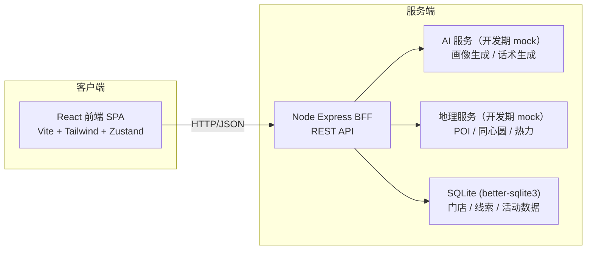
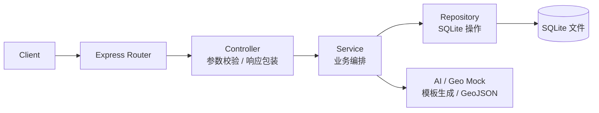
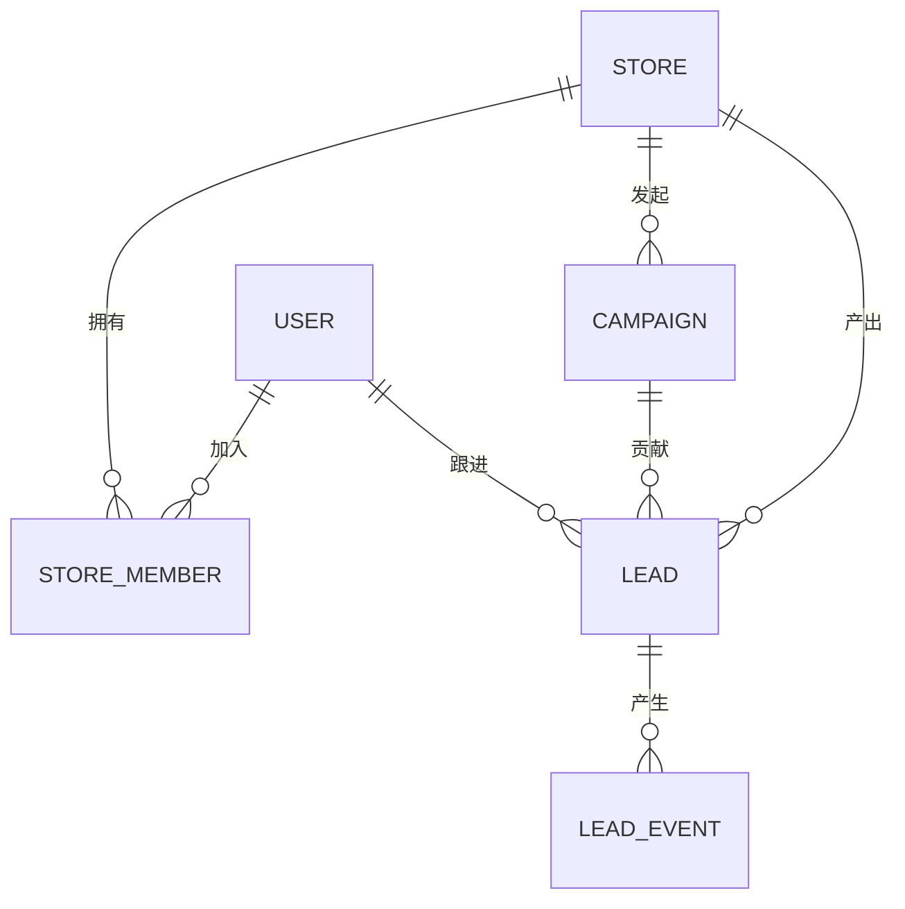

# 邻客 AI - 技术架构文档

## 1. 架构设计

本项目采用 **前端单页应用 + 轻量 BFF（Backend For Frontend） + Mock 数据层** 的架构。所有 AI 能力通过 BFF 转发到模型服务（开发期使用 mock，投产可替换为真实大模型 API）。地理 / POI 数据在开发期使用本地 GeoJSON 模拟，地图底图接入高德 / Mapbox 风格的瓦片 mock（自绘 SVG 地图）。



## 2. 技术栈描述

- **前端框架**：React@18 + TypeScript + Vite@5
- **样式方案**：Tailwind CSS@3 + 自定义 CSS 变量（暗色科技风）
- **状态管理**：Zustand（全局：当前门店、当前半径、登录态、线索筛选）
- **路由**：React Router@6
- **地图**：自绘 SVG 同心圆 + Leaflet 风格交互（开发期 mock 数据，无外网依赖）
- **图表**：Recharts（数据看板雷达图 / 折线 / 柱状）
- **图标**：lucide-react
- **动画**：Framer Motion（半径切换、抽屉、节点编排）
- **BFF**：Express@4 + TypeScript + ESM
- **数据存储**：better-sqlite3（开发期本地持久化，文件型数据库）
- **AI 能力**：开发期由 BFF 内置 mock 文案生成器（基于模板 + 概率组合），投产可替换为真实 LLM
- **包管理**：pnpm（优先）/ npm
- **初始化模板**：`react-express-ts`（默认，前后端一体化）

## 3. 路由定义

| 路由 | 用途 | 鉴权 |
|------|------|------|
| `/login` | 登录 / 注册 | 公开 |
| `/` | 获客驾驶舱（重定向到 `/cockpit`） | 需要登录 |
| `/cockpit` | 获客驾驶舱（首页 + AI 建议） | 需要登录 |
| `/map` | 地图工作台（同心圆 + 高潜 POI + 抽屉） | 需要登录 |
| `/persona` | AI 客户画像 + 话术生成 | 需要登录 |
| `/campaign` | 智能营销中心（渠道编排画布） | 需要登录 |
| `/leads` | 线索池（列表 + 详情） | 需要登录 |
| `/dashboard` | 数据看板 | 需要登录 |
| `/settings` | 门店与成员管理 | 需要登录 |
| `/api/*` | BFF 接口（见 §4） | — |

## 4. API 定义

所有接口前缀 `/api`，请求与响应均为 JSON。

### 4.1 认证

```ts
// POST /api/auth/login
type LoginReq = { phone: string; code: string };
type LoginRes = { token: string; user: User };

// GET  /api/auth/me
type MeRes = { user: User };
```

### 4.2 门店与半径

```ts
// GET /api/stores
type Store = { id: string; name: string; lng: number; lat: number; address: string };
type StoresRes = { stores: Store[] };

// GET /api/stores/:id/radius?km=3,5,8,10
type RadiusStats = {
  km: 3 | 5 | 8 | 10;
  population: number;
  hotSpots: number;       // 高潜 POI 数量
  avgScore: number;       // 0-100
};
type RadiusStatsRes = { stats: RadiusStats[]; geojson: GeoJSON.FeatureCollection };
```

### 4.3 AI 画像与话术

```ts
// POST /api/ai/persona
type PersonaReq = { storeId: string; radiusKm: 3 | 5 | 8 | 10; categories: string[] };
type Persona = {
  summary: string;
  radar: { dim: string; value: number }[];   // 年龄 / 消费力 / 活跃度 / 复购 / 价格敏感 / 社交裂变
  keywords: string[];
};
type PersonaRes = { persona: Persona };

// POST /api/ai/copywriting
type CopyReq = { personaId: string; channel: 'sms' | 'wechat' | 'douyin' | 'card' };
type Copy = { title: string; body: string; cta: string };
type CopyRes = { copies: Copy[] };           // 一次返回 3 套
```

### 4.4 营销活动

```ts
// POST /api/campaigns
type CampaignReq = { name: string; radiusKm: number; flow: FlowNode[]; scheduleAt?: string };
type CampaignRes = { id: string };

// GET  /api/campaigns
type CampaignsRes = { campaigns: Campaign[] };
```

### 4.5 线索

```ts
// GET  /api/leads?status=&storeId=&page=
type Lead = {
  id: string; name: string; phone: string; fromRadius: 3 | 5 | 8 | 10;
  status: 'pending' | 'added' | 'visited' | 'won' | 'lost';
  ownerId?: string; createdAt: string;
};
type LeadsRes = { total: number; items: Lead[] };

// PATCH /api/leads/:id
type UpdateLeadReq = { status?: Lead['status']; ownerId?: string; note?: string };
```

### 4.6 数据看板

```ts
// GET /api/dashboard/overview?range=7d|30d
type Overview = {
  reach: number;            // 总曝光
  addedWechat: number;      // 加微
  visited: number;          // 到店
  roi: number;              // ROI 倍数
  trend: { date: string; reach: number; added: number; visited: number }[];
  radiusCompare: { km: 3 | 5 | 8 | 10; cost: number; conv: number }[];
};
type OverviewRes = { overview: Overview };
```

## 5. 服务端架构

BFF 采用经典三层：Controller 解析参数 → Service 执行业务 → Repository 访问 SQLite。



## 6. 数据模型

### 6.1 数据模型定义



### 6.2 数据定义语言

```sql
-- 用户
CREATE TABLE user (
  id            TEXT PRIMARY KEY,
  phone         TEXT UNIQUE NOT NULL,
  name          TEXT,
  created_at    TEXT NOT NULL DEFAULT (datetime('now'))
);

-- 门店
CREATE TABLE store (
  id            TEXT PRIMARY KEY,
  name          TEXT NOT NULL,
  lng           REAL NOT NULL,
  lat           REAL NOT NULL,
  address       TEXT,
  owner_user_id TEXT NOT NULL REFERENCES user(id),
  created_at    TEXT NOT NULL DEFAULT (datetime('now'))
);

-- 门店成员（多对多）
CREATE TABLE store_member (
  store_id      TEXT NOT NULL REFERENCES store(id),
  user_id       TEXT NOT NULL REFERENCES user(id),
  role          TEXT NOT NULL CHECK (role IN ('owner','manager','bd')),
  PRIMARY KEY (store_id, user_id)
);

-- 营销活动
CREATE TABLE campaign (
  id            TEXT PRIMARY KEY,
  store_id      TEXT NOT NULL REFERENCES store(id),
  name          TEXT NOT NULL,
  radius_km     INTEGER NOT NULL,
  flow_json     TEXT NOT NULL,        -- 编排节点 JSON
  schedule_at   TEXT,
  status        TEXT NOT NULL DEFAULT 'draft',
  created_at    TEXT NOT NULL DEFAULT (datetime('now'))
);

-- 线索
CREATE TABLE lead (
  id            TEXT PRIMARY KEY,
  store_id      TEXT NOT NULL REFERENCES store(id),
  campaign_id   TEXT REFERENCES campaign(id),
  from_radius   INTEGER NOT NULL,     -- 3 / 5 / 8 / 10
  name          TEXT NOT NULL,
  phone         TEXT NOT NULL,
  status        TEXT NOT NULL DEFAULT 'pending',
  owner_id      TEXT REFERENCES user(id),
  created_at    TEXT NOT NULL DEFAULT (datetime('now'))
);

-- 线索事件（跟进时间线）
CREATE TABLE lead_event (
  id            TEXT PRIMARY KEY,
  lead_id       TEXT NOT NULL REFERENCES lead(id),
  type          TEXT NOT NULL,        -- touch / added / visited / note
  payload_json  TEXT,
  created_at    TEXT NOT NULL DEFAULT (datetime('now'))
);

-- 索引
CREATE INDEX idx_lead_store_status ON lead(store_id, status);
CREATE INDEX idx_campaign_store ON campaign(store_id);
CREATE INDEX idx_event_lead ON lead_event(lead_id, created_at);

-- 初始种子数据
INSERT INTO user(id, phone, name) VALUES
  ('u_demo', '13800000000', '示例店长');

INSERT INTO store(id, name, lng, lat, address, owner_user_id) VALUES
  ('s_demo', '邻客 AI 体验店', 116.480885, 39.989410, '北京市朝阳区示例路 1 号', 'u_demo');

INSERT INTO store_member(store_id, user_id, role) VALUES
  ('s_demo', 'u_demo', 'owner');

INSERT INTO campaign(id, store_id, name, radius_km, flow_json, status) VALUES
  ('c_3km', 's_demo', '3 公里写字楼拓客', 3,
   '[{"id":"n1","type":"copy","channel":"wechat"},{"id":"n2","type":"wait","min":1440},{"id":"n3","type":"copy","channel":"sms"}]',
   'running');

INSERT INTO lead(id, store_id, campaign_id, from_radius, name, phone, status) VALUES
  ('l_001', 's_demo', 'c_3km', 3, '王女士', '13900000001', 'added'),
  ('l_002', 's_demo', 'c_3km', 3, '李先生', '13900000002', 'visited'),
  ('l_003', 's_demo', 'c_3km', 5, '张小姐', '13900000003', 'pending');
```

### 6.3 种子 GeoJSON

为模拟"3 / 5 / 8 / 10 km 同心圆内的 POI"，`/api/stores/:id/radius` 会在 BFF 内基于门店经纬度生成同心圆 Polygon + 12 - 30 个高潜 POI（学校 / 写字楼 / 商场 / 住宅），用于地图工作台渲染，无需外部地图厂商。
